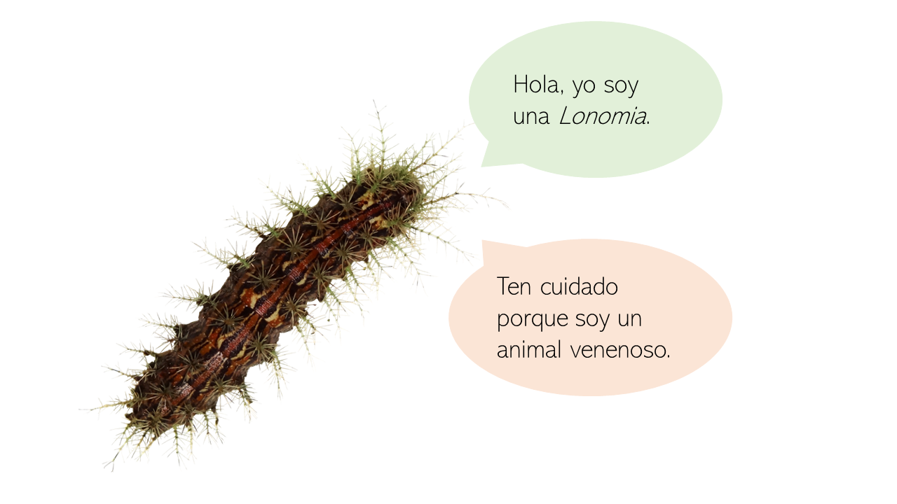

# Caracterización Clínica y Epidemiológica de los Accidentes con Lonomia en Misiones (Argentina)

¡Bienvenido!

Aquí tendrá acceso al [resumen](https://github.com/MMFBio/Simposio_Latinoamericano_Biociencias_II/blob/master/Resumo_Pr%C3%A1ticas%20em%20sa%C3%BAde%20baseada%20em%20evid%C3%AAncias_Marilia%20Melo%20Favalesso.pdf), [análisis estadísticos](https://github.com/MMFBio/Simposio_Latinoamericano_Biociencias_II/blob/master/R_script_simposio_biocienciasII.R) y [poster](https://github.com/MMFBio/Simposio_Latinoamericano_Biociencias_II/blob/master/banner_lonomia.pdf) del trabajo "**CARACTERIZACIÓN CLÍNICA Y EPIDEMIOLÓGICA DE LOS ACCIDENTES CON *Lonomia* EN MISIONES (ARGENTINA)**", presentado en el ["II Simposio Latinoamericano de Biociências"](https://simposiobiociencia.wixsite.com/iisimposio), en la ciudad de Foz de Iguaçu (Brasil), entre el 30 de septiembre y el 4 de octubre de 2019.

⭐ Este trabajo fue clasificado entre los tres mejores durante el simposio.

## Estructura del Repositorio

- **/R_script_simposio_biocienciasII.R** - El script R que contiene todos los análisis estadísticos realizados. El código está bien documentado y organizado para facilitar la reproducción de los análisis.
  
- **/apresentacao_slides.pdf** - Los slides utilizados en la presentación oral. Contienen una descripción detallada de los métodos, resultados y conclusiones del estudio.
  
- **/banner_lonomia.pdf** - Presentación en formato de banner que resume los principales hallazgos del estudio de forma visual.
  
- **/Resumo_Práticas_em_saúde_baseada_em_evidências_Marilia_Melo_Favalesso.pdf** - Resumen del trabajo, proporcionando una visión general sobre la caracterización clínica y epidemiológica de los accidentes con Lonomia en Misiones, Argentina.

## Sobre el Estudio

El estudio presenta una descripción epidemiológica de los accidentes con *Lonomia* registrados por el Hospital SAMIC de Puerto Iguazú, entre 2014 y 2018. Los análisis incluyeron la distribución de los casos por año, mes, departamento, factores demográficos, características del accidente, datos clínicos y tratamiento recibido.

### Objetivos
- Proporcionar un panorama epidemiológico general del lonomismo en Misiones.
- Servir de base para la toma de decisiones por parte de las autoridades de salud pública, garantizando estrategias de prevención y manejo seguro y eficiente de las víctimas de envenenamiento.

### Autores
- Marília Melo Favalesso¹
- Esteban M. Couto²
- Micaela Andrea Gritti¹
- Milena Gisela Casafús¹
- Ana Tereza Bittencourt Guimarães³
- María Elisa Peichoto¹

¹ Consejo Nacional de Investigaciones Científicas y Técnicas (CONICET), Instituto Nacional de Medicina Tropical (INMeT), Puerto Iguazú – Misiones – Argentina.  
² Hospital SAMIC, Puerto Iguazú – Misiones – Argentina.  
³ Universidade Estadual do Oeste do Paraná, Cascavel – Paraná – Brasil.

Para más información, contactar a Marília Melo Favalesso (biologist.mmf@gmail.com).

